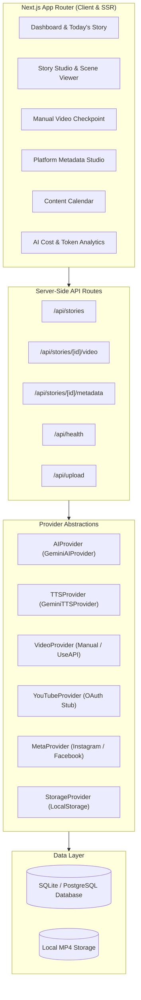

# System Architecture & Technical Design

## 1. High-Level Architecture

The **Hindi Kids Shorts Studio** is architected as a modular TypeScript/Next.js application with clean provider boundaries.

## 2. Status Transitions

Stories advance through explicit states:
1. `IDEA` -> Story concept generated.
2. `STORY_GENERATED` -> Full narration and scene breakdown ready.
3. `PROMPTS_READY` -> Master style and per-scene Google Flow prompts synthesized.
4. `VIDEO_PENDING` -> Prompts copied, waiting for video generation in Google Flow.
5. `VIDEO_ADDED` -> MP4 uploaded or YouTube Short URL pasted into dashboard.
6. `READY_TO_PUBLISH` -> YouTube, Instagram, and Facebook social metadata generated and approved.
7. `PUBLISHED` -> Video confirmed live on social platforms.
